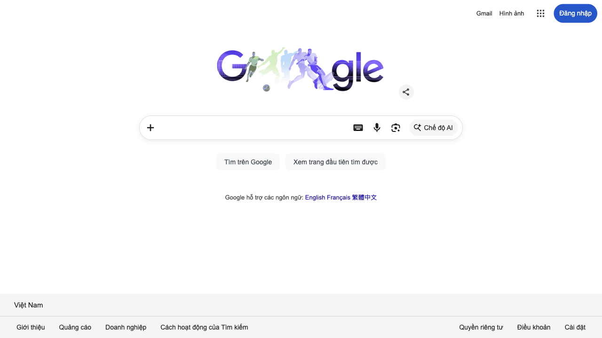
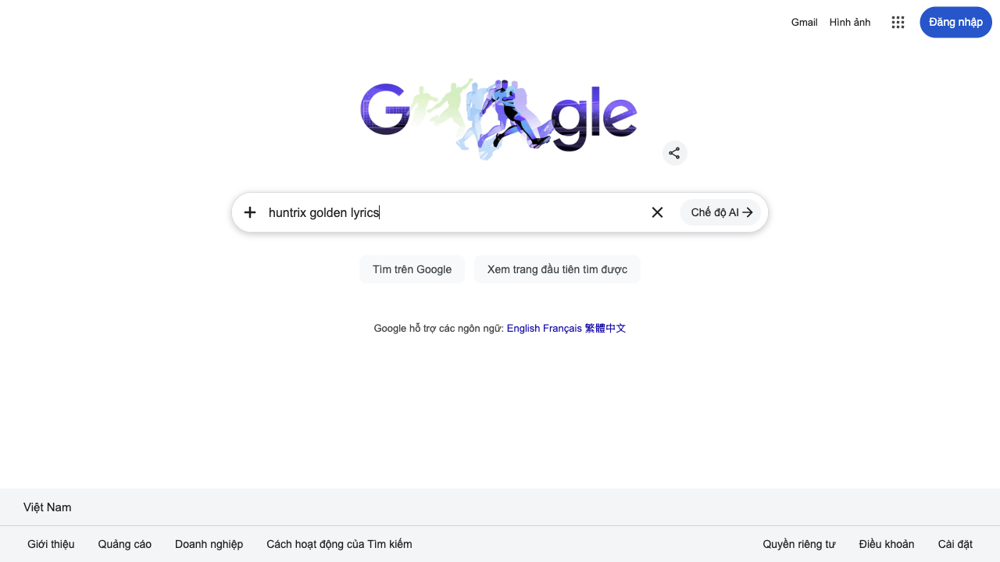
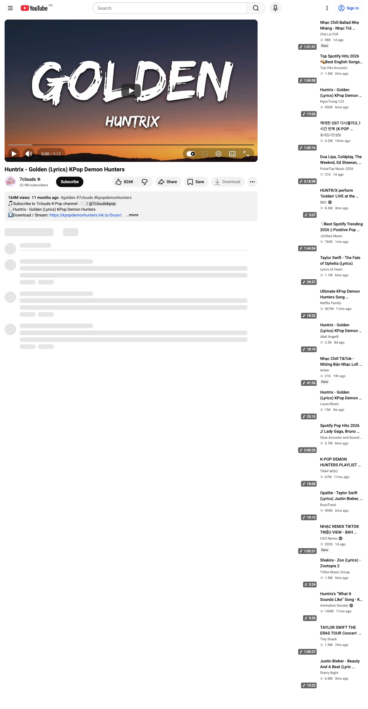

# Browser Use Local Bridge for n8n

This is a local bridge service that enables n8n to communicate with the Browser Use Python library. It mimics the Browser Use Cloud API endpoints but runs locally, allowing you to execute browser automation tasks without relying on the cloud service.

## Features

- Compatible with the Browser Use Cloud API endpoints
- Supports OpenAI, Anthropic, Google, Ollama, DeepSeek, Azure OpenAI, and Bedrock providers
- Provides task management (run, pause, resume, stop)
- Exposes status tracking and result retrieval
- Captures browser observations (screenshot + DOM snapshot)
- Stores per-task trajectory memory for debugging and replay
- Supports hybrid reward signals (automatic heuristic + manual feedback)

## Architecture Flow

1. Client starts a task with `POST /api/v1/run-task`.
2. Agent runs in the background and captures step-start screenshots.
3. For each captured screenshot, the service also stores browser observations:
   - Current URL
   - Page title
   - DOM snapshot (truncated when needed)
4. The task timeline is saved as a trajectory event stream.
5. On completion/failure, the service computes an automatic reward score.
6. Users can submit manual reward feedback via `POST /api/v1/task/{task_id}/reward`.
7. `GET /api/v1/task/{task_id}` returns task details plus observations, trajectory, and reward.

## Core Concepts

### Web Eye (Observation)

The Web Eye is implemented as structured browser observations that are captured during execution. Each observation includes screenshot linkage and page context, which makes the agent behavior easier to inspect.

### Per-Task Memory

Memory is currently stored as per-task trajectory events (`trajectory`) plus observations (`observations`). This is intentionally simple for the demo-first milestone and avoids introducing database complexity too early.

### Reward Loop

The service now supports a hybrid reward model:

- `auto_score`: heuristic score based on terminal task outcome.
- `manual_score`: user-provided score for human-in-the-loop correction.
- `effective_score`: resolved score used for downstream evaluation (manual overrides automatic).

## Prerequisites

- Python 3.10 or higher
- pip (Python package manager)
- Browser Use Python library
- API keys for at least one provider (for example OpenAI, Anthropic, or DeepSeek)

## Installation

1. Clone this repository:

   ```bash
   git clone https://github.com/henry0hai/browser-n8n-local.git
   cd browser-n8n-local
   ```

2. Create a virtual environment (recommended):

   ```bash
   python -m venv venv
   source venv/bin/activate  # On Windows: venv\Scripts\activate
   ```

3. Install the required dependencies:

   ```bash
   pip install -r requirements.txt
   ```

4. Set up environment variables:
   ```bash
   cp .env.example .env
   ```
   Then edit the `.env` file to add API keys for your chosen provider.

## Running the Service

1. Start the FastAPI server:

   ```bash
   python app.py
   ```

2. The server will start at http://localhost:8000 by default.

3. You can access the API documentation at http://localhost:8000/docs

## API Endpoints

| Method | Endpoint                           | Description                |
| ------ | ---------------------------------- | -------------------------- |
| POST   | /api/v1/run-task                   | Start a new browser task   |
| GET    | /api/v1/task/{task_id}             | Get task details           |
| GET    | /api/v1/task/{task_id}/status      | Get task status            |
| PUT    | /api/v1/stop-task/{task_id}        | Stop a running task        |
| PUT    | /api/v1/pause-task/{task_id}       | Pause a running task       |
| PUT    | /api/v1/resume-task/{task_id}      | Resume a paused task       |
| POST   | /api/v1/task/{task_id}/reward      | Submit manual reward score |
| GET    | /api/v1/list-tasks                 | List all tasks             |
| GET    | /live/{task_id}                    | Live view UI               |
| GET    | /api/v1/ping                       | Check health               |
| GET    | /api/v1/task/{task_id}/media       | Get task media             |
| GET    | /api/v1/task/{task_id}/media/list  | List all media from task   |
| GET    | /api/v1/media/{task_id}/{filename} | Display task media content |

## Usage Examples

### Provider Selection (Important)

You do not pass any provider parameter to `python app.py`.

Provider selection happens in one of two ways:

1. Global default provider from `.env` via `DEFAULT_AI_PROVIDER`
2. Per-task override in the `POST /api/v1/run-task` body using `ai_provider`

If `ai_provider` is omitted in a request, the server uses `DEFAULT_AI_PROVIDER`.

Set Ollama as default in `.env`:

```env
DEFAULT_AI_PROVIDER=ollama
OLLAMA_API_BASE=http://localhost:11434
OLLAMA_MODEL_ID=lfm2.5:8b
```

Set DeepSeek as default in `.env`:

```env
DEFAULT_AI_PROVIDER=deepseek
DEEPSEEK_API_KEY=your_deepseek_api_key_here
DEEPSEEK_MODEL_ID=deepseek-chat
DEEPSEEK_BASE_URL=https://api.deepseek.com/v1
```

Then start server normally:

```bash
python app.py
```

### Starting a Task

```bash
curl -X POST http://localhost:8000/api/v1/run-task \
  -H "Content-Type: application/json" \
  -d '{"task": "Go to google.com and search for n8n automation", "ai_provider": "openai"}'
```

Use Ollama for a specific task (overrides default):

```bash
curl -X POST http://localhost:8000/api/v1/run-task \
   -H "Content-Type: application/json" \
   -d '{"task": "Open example.com and summarize the page", "ai_provider": "ollama"}'
```

Use DeepSeek for a specific task (overrides default):

```bash
curl -X POST http://localhost:8000/api/v1/run-task \
   -H "Content-Type: application/json" \
   -d '{"task": "Open example.com and summarize the page", "ai_provider": "deepseek"}'
```

### Checking Task Status

```bash
curl -X GET http://localhost:8000/api/v1/task/{task_id}/status
```

### Stopping a Task

```bash
curl -X PUT http://localhost:8000/api/v1/stop-task/{task_id}
```

### Submitting Manual Reward Feedback

```bash
curl -X POST http://localhost:8000/api/v1/task/{task_id}/reward \
   -H "Content-Type: application/json" \
   -d '{"manual_score": 0.9, "reason": "Task completed accurately"}'
```

### Inspecting Observation and Reward Data

```bash
curl -X GET http://localhost:8000/api/v1/task/{task_id}
```

Look for these fields in the task payload:

- `observations`
- `trajectory`
- `reward`

## Configuration Options

You can configure the service by editing the `.env` file. Available options are grouped below:

### API Configuration

- `PORT`: The port the service will run on (default: 8000).

### LLM Provider Configuration

The application supports multiple AI providers. You can specify the provider in each request using the `ai_provider` parameter. If not specified, it defaults to `openai`. To change the default provider, set the `DEFAULT_AI_PROVIDER` environment variable.

#### OpenAI

- `OPENAI_API_KEY`: Your OpenAI API key.
- `OPENAI_MODEL_ID`: The model to use (e.g., `gpt-4o`).
- `OPENAI_BASE_URL`: Optional custom endpoint for OpenAI compatible APIs.

#### Anthropic

- `ANTHROPIC_API_KEY`: Your Anthropic API key.
- `ANTHROPIC_MODEL_ID`: The model to use (e.g., `claude-3-opus-20240229`).

#### MistralAI

- `MISTRAL_API_KEY`: Your MistralAI API key.
- `MISTRAL_MODEL_ID`: The model to use (e.g., `mistral-large-latest`).

#### Google AI

- `GOOGLE_API_KEY`: Your Google AI API key.
- `GOOGLE_MODEL_ID`: The model to use (e.g., `gemini-1.5-pro`).

#### Ollama

- `OLLAMA_API_BASE`: The base URL for your Ollama instance.
- `OLLAMA_MODEL_ID`: The model to use (e.g., `llama3`).

#### DeepSeek

- `DEEPSEEK_API_KEY`: Your DeepSeek API key.
- `DEEPSEEK_MODEL_ID`: The model to use (e.g., `deepseek-chat` or `deepseek-reasoner`).
- `DEEPSEEK_BASE_URL`: DeepSeek compatible API base URL (default: `https://api.deepseek.com/v1`).

#### Azure OpenAI

- `AZURE_API_KEY`: Your Azure OpenAI API key.
- `AZURE_ENDPOINT`: Your Azure OpenAI endpoint URL.
- `AZURE_DEPLOYMENT_NAME`: Your deployment name.
- `AZURE_API_VERSION`: API version to use.

#### Amazon Bedrock

- `BEDROCK_MODEL_ID`: The model ID to use for Amazon Bedrock (e.g., `anthropic.claude-3-sonnet-20240229-v1:0`).
- `AWS_ACCESS_KEY_ID`: Your AWS Access Key ID.
- `AWS_SECRET_ACCESS_KEY`: Your AWS Secret Access Key.
- `AWS_REGION`: The AWS region where your Bedrock service is hosted (e.g., `us-east-1`).

If `AWS_ACCESS_KEY_ID`, `AWS_SECRET_ACCESS_KEY`, and `AWS_REGION` are not explicitly set, the AWS SDK will attempt to use its default credential provider chain (e.g., IAM roles, shared credentials file).

### Optional Configuration

- `LOG_LEVEL`: Logging level (default: `INFO`).
- `BROWSER_USE_HEADFUL`: Set to `"true"` to run the browser in headful mode (default: `false`, runs in headless mode).
- `BROWSER_USE_VISION`: Controls whether image inputs are sent to the model. If unset, the app auto-disables vision for `ollama` and `deepseek`, and enables it for other providers.
- `TASK_RUN_TIMEOUT_SECONDS`: Maximum task runtime before force stop (default: `120`).
- `AGENT_MAX_STEPS`: Hard cap for agent reasoning/action steps (default: `8`).
- `STATUS_TRACK_STEPS_ON_POLL`: If `true`, each status poll appends synthetic progress steps (default: `false`).
- `STATUS_CAPTURE_SCREENSHOT`: If `true`, status polling can trigger screenshots (default: `false`).
- `STATUS_SCREENSHOT_MIN_INTERVAL_SECONDS`: Minimum interval between status-triggered screenshots (default: `10`).
- `AGENT_ENFORCE_CONCISE_EXECUTION`: If `true`, appends execution constraints to reduce repetitive/irrelevant actions (default: `true`).
- `ENABLE_SIMPLE_TITLE_SHORTCUT`: If `true`, simple “get page title from URL” tasks use a deterministic fast path instead of full autonomous loops (default: `true`).
- `PASS_SENSITIVE_DATA_TO_AGENT`: If `true`, env vars prefixed with `X_` are passed to the agent as sensitive values (default: `false`).
- `LOOP_GUARD_MAX_CONSECUTIVE_DUPLICATE_SCREENSHOTS`: Stops a task early when repeated duplicate screenshots indicate no progress (default: `3`).
- `LOOP_GUARD_MAX_SCREENSHOT_ERRORS`: Stops a task early when screenshot capture repeatedly fails (default: `3`).

## Troubleshooting

- **ImportError with browser-use**: Make sure you have installed the browser-use package and its dependencies correctly.
- **API Key Issues**: Verify that your API keys are correctly set in the `.env` file.
- **Port Conflicts**: If port 8000 is already in use, set a different port in the `.env` file.
- **`Multimodal data provided, but model does not support multimodal requests`**:
  - Cause: The selected model is text-only but vision input was sent.
  - Fix: Set `BROWSER_USE_VISION=false` in `.env` (or use a multimodal model).
  - For Ollama text-only models such as `lfm2.5:8b`, keep `BROWSER_USE_VISION=false`.
- **Task seems too slow or loops too long**:
  - Reduce loop budget with `AGENT_MAX_STEPS=4` to `8`.
  - Enforce shorter runtime with `TASK_RUN_TIMEOUT_SECONDS=60` to `120`.
  - Keep status-side overhead low: `STATUS_TRACK_STEPS_ON_POLL=false` and `STATUS_CAPTURE_SCREENSHOT=false`.
  - Keep `AGENT_ENFORCE_CONCISE_EXECUTION=true` to discourage tool-chatter loops.
  - Enable early loop stop with `LOOP_GUARD_MAX_CONSECUTIVE_DUPLICATE_SCREENSHOTS=2` to `4`.
  - Stop unstable browser states with `LOOP_GUARD_MAX_SCREENSHOT_ERRORS=2` to `4`.

- **Agent keeps typing into unrelated fields**:
  - Keep `PASS_SENSITIVE_DATA_TO_AGENT=false` unless your task specifically needs credential autofill behavior.

## Examples

Runnable examples are available in the `examples/` directory:

- `01_basic_flow.py`: start a task, poll for completion, inspect final payload.
- `01_advanced_flow.py`: run a multi-step search/watch-page extraction flow and inspect final payload.

See `examples/README.md` for script details and real sample outputs.

Run any example:

```bash
python examples/01_basic_flow.py --base-url http://localhost:8000
```

Run example with explicit provider override:

```bash
python examples/01_basic_flow.py --base-url http://localhost:8000 --provider ollama
python examples/01_basic_flow.py --base-url http://localhost:8000 --provider deepseek
```

Sample query:

```python
parser.add_argument(
    "--task",
    default=(
        "Go to google.com and search for 'huntrix golden lyrics'. "
        "On the search results page, click the first link that points to youtube.com/watch (or a YouTube video card) immediately; do not keep scrolling. "
        "If clicking a YouTube result fails after one attempt, navigate directly to https://www.youtube.com/results?search_query=huntrix+golden+lyrics and open the first video result. "
        "On the YouTube watch page, report the view count, like count, and upload/release date shown on the page."
        "Export the results as a JSON object with keys 'view_count', 'like_count', and 'upload_date'."
    ),
    help="Task instruction",
)
```

Example output:

````bash
{
  "id": "4be9cb39-e067-4d5f-b290-80ffb8358488",
  "status": "finished",
  "observations": 0,
  "trajectory_events": 2,
  "reward": {
    "auto_score": 0.8,
    "manual_score": null,
    "effective_score": 0.8,
    "source": "auto",
    "reason": "task finished with non-empty output",
    "updated_at": "2026-06-22T07:47:05.100077+00:00Z"
  },
  "output": "<url>\nhttps://www.youtube.com/watch?v=htk6MRjmcnQ\n</url>\n<query>\nPlease find the view count, the number of likes, and the upload/release date for the video shown on this page. Structure the output as a JSON object with keys 'view_count', 'like_count', and 'upload_date'.\n</query>\n<result>\n```json\n{\n  \"view_count\": \"164,669,057\",\n  \"like_count\": \"826K\",\n  \"upload_date\": \"Jul 1, 2025\"\n}\n```\n</result>",
  "error": null
}
````

Sample run images:






## Limitations (Current Milestone)

- Storage is in-memory only; task data is lost on process restart.
- Reward signals are evaluation metadata, not online RL training.
- Cross-task episodic memory retrieval is not implemented yet.

## License

This project is licensed under the MIT License - see the LICENSE file for details.

## Acknowledgements

- [Browser Use](https://github.com/browser-use/browser-use) - The underlying browser automation library
- [FastAPI](https://fastapi.tiangolo.com/) - The web framework used
- [n8n](https://n8n.io/) - The workflow automation platform this bridge is designed for # browser-n8n-local

## Star History

<a href="https://www.star-history.com/?repos=henry0hai%2Fbrowser-n8n-local&type=date&legend=top-left">
 <picture>
   <source media="(prefers-color-scheme: dark)" srcset="https://api.star-history.com/chart?repos=henry0hai/browser-n8n-local&type=date&theme=dark&legend=top-left" />
   <source media="(prefers-color-scheme: light)" srcset="https://api.star-history.com/chart?repos=henry0hai/browser-n8n-local&type=date&legend=top-left" />
   
 </picture>
</a>
