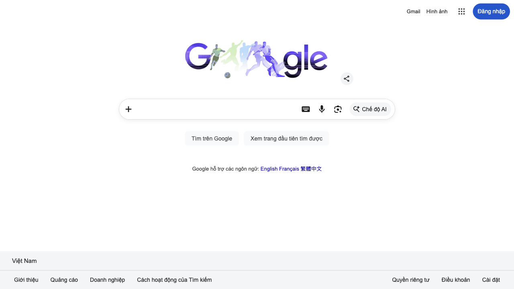
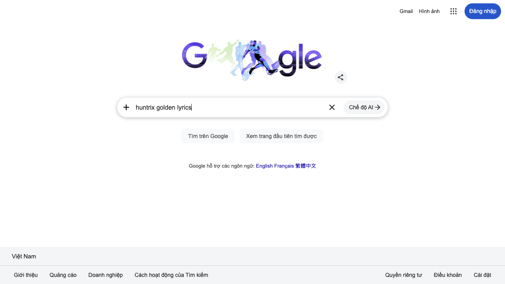
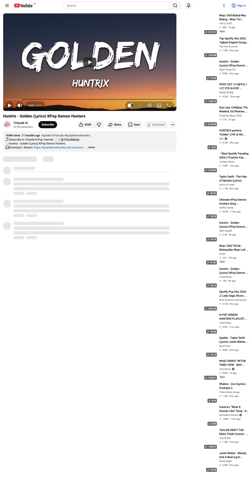

# Browser Use Local Bridge for n8n

This is a local bridge service that enables n8n (or any HTTP client) to drive the Browser Use Python library. It implements the **Browser Use Cloud v4 API** (Runs, Sessions and Browsers) locally, so browser automation tasks run on your own machine instead of the cloud service.

> **v4 only.** The pre-v4 task API and the old `/api/v1` path prefix (`/run-task`, `/task/{id}`, `/stop-task`, `/pause-task`, `/resume-task`, `/list-tasks`, `/task/{id}/reward`, `/task/{id}/media*`, `/test-screenshot`) has been removed. Use the Run, Session and Browser resources below. Every route lives under `/api/v4`, the real cloud's base path, so pointing a client at this bridge is a base-URL swap. The old `/api/v4` prefix is gone. Request and response bodies follow the v4 schemas, with the deviations listed in [Differences from the real v4 API](#differences-from-the-real-browser-use-cloud-v4-api).

## Features

- Optional [Jev](https://docs.typesafe.ai/introduction) navigation (`DEFAULT_NAVIGATOR=jev`, or `"navigator": "jev"` on a run): TypeSafe picks each click or keystroke from the elements on the page, and a run returns its final page state, or an LLM-written answer on request
- Browser Use Cloud v4 **Run**, **Session** and **Browser** resources (works with the `n8n-nodes-browser-use-cloud` community node set to API Version v4, or with plain HTTP requests)
- Supports OpenAI, Anthropic, Google, Ollama, DeepSeek, Azure OpenAI, and Bedrock providers (chosen with `DEFAULT_AI_PROVIDER`)
- Sessions that keep one browser open across follow-up messages (login state survives between runs)
- Bridge-only extensions under `/bridge/` (kept out of the v4 namespace): form-value inspection, page outline, PDF text extraction
- Loop guard, per-run timeout and step budget (see Configuration Options)

## Architecture Flow

1. Client starts a run with `POST /api/v4/runs` (optionally with a `sessionId` to reuse a session's browser).
2. The agent runs in the background and captures step screenshots (watchable at `/live/{run_id}`).
3. The client polls `GET /api/v4/runs/{run_id}/status` (or `GET /api/v4/runs/{run_id}` for the result) until the status is `completed`, `failed` or `cancelled`.
4. With a `sessionId`, the browser stays open afterwards; later `POST /api/v4/runs` calls with the same `sessionId` continue in the same page. `POST /api/v4/sessions/{session_id}/purge` closes it.
5. Files downloaded during a run are listed by `GET /api/v4/runs/{run_id}/attachments`.

Task data (status, output, screenshots, an internal trajectory of observations and an automatic quality score) is stored under `task_storage/`. It is not exposed through the API.

## Prerequisites

- Python 3.10 or higher (3.12 or newer for the optional [Jev Navigator](#jev-navigator))
- pip (Python package manager)
- Browser Use Python library
- API keys for at least one provider (for example OpenAI, Anthropic, or DeepSeek)

## Installation

1. Clone this repository:

   ```bash
   git clone https://github.com/henry0hai/browser-n8n-local.git
   cd browser-n8n-local
   ```

2. Create a virtual environment (recommended):

   ```bash
   python -m venv venv
   source venv/bin/activate  # On Windows: venv\Scripts\activate
   ```

3. Install the required dependencies:

   ```bash
   pip install -r requirements.txt
   ```

4. Set up environment variables:
   ```bash
   cp .env.example .env
   ```
   Then edit the `.env` file to add API keys for your chosen provider.

## Running the Service

1. Start the FastAPI server:

   ```bash
   python app.py
   ```

2. The server will start at http://localhost:8000 by default.

3. You can access the API documentation at http://localhost:8000/docs

### Running as a macOS Service (launchd)

To keep the server running in the background and auto-restart on crash/login, use a launchd LaunchAgent:

1. Create `~/Library/LaunchAgents/com.browser-n8n-local.plist`:

   ```xml
   <?xml version="1.0" encoding="UTF-8"?>
   <!DOCTYPE plist PUBLIC "-//Apple//DTD PLIST 1.0//EN" "http://www.apple.com/DTDs/PropertyList-1.0.dtd">
   <plist version="1.0">
   <dict>
       <key>Label</key>
       <string>com.browser-n8n-local</string>

       <key>ProgramArguments</key>
       <array>
           <string>/path/to/browser-n8n-local/venv/bin/python</string>
           <string>/path/to/browser-n8n-local/app.py</string>
       </array>

       <key>WorkingDirectory</key>
       <string>/path/to/browser-n8n-local</string>

       <key>RunAtLoad</key>
       <true/>

       <key>KeepAlive</key>
       <true/>

       <key>StandardOutPath</key>
       <string>/path/to/browser-n8n-local/logs/service.out.log</string>

       <key>StandardErrorPath</key>
       <string>/path/to/browser-n8n-local/logs/service.err.log</string>
   </dict>
   </plist>
   ```

   Replace `/path/to/browser-n8n-local` with your actual install path, and create the `logs/` directory.

2. Load and start it:

   ```bash
   launchctl load ~/Library/LaunchAgents/com.browser-n8n-local.plist
   ```

3. Check status / logs:

   ```bash
   launchctl list | grep browser-n8n-local
   tail -f logs/service.err.log
   ```

4. Stop / unload:

   ```bash
   launchctl unload ~/Library/LaunchAgents/com.browser-n8n-local.plist
   ```

`.env` is loaded automatically via `load_dotenv()` since `WorkingDirectory` is set to the project root.

## API Endpoints

All paths are under `/api/v4`. Bodies follow the [Browser Use Cloud v4 API](https://docs.browser-use.com/cloud/api-v4).

### Run resource

| Method | Endpoint                          | Notes |
| ------ | ---------------------------------- | ----- |
| POST   | /api/v4/runs                       | Create a run. Body: `task` (required), `sessionId` (optional), and two optional bridge extensions: `navigator` (`jev` or `browser-use`) and `extract` (`true` adds an LLM-written answer to a Jev run). Returns `{id, status, model, sessionId, workspaceId, eventsUrl}` |
| GET    | /api/v4/runs/{run_id}               | Get a run: `{id, task, status, model, result, output, error, sessionId, workspaceId, createdAt, finishedAt}` |
| GET    | /api/v4/runs/{run_id}/status        | `{id, status}` (cheap polling) |
| POST   | /api/v4/runs/{run_id}/cancel        | Cancel a run |
| GET    | /api/v4/runs                       | List runs (`cursor`, `limit`) |
| GET    | /api/v4/runs/{run_id}/events        | Always empty: no step event stream is recorded locally |
| GET    | /api/v4/runs/{run_id}/attachments   | Files produced by the run |

Run `status` is one of `queued` (create response only), `running`, `completed`, `failed`, `cancelled`. Run-create fields that only make sense on the real cloud (`model`, `modelParams`, `workspaceId`, `maxCostUsd`, `attachedFileIds`, `judge`, `browserSettings`, ...) are accepted and ignored; the LLM comes from `DEFAULT_AI_PROVIDER` (for Jev runs, see [Jev Navigator](#jev-navigator)).

### Session resource

Sessions keep one browser open across messages. The first run with a `sessionId` starts the browser; the browser is kept alive afterward and later runs with the same `sessionId` are driven into the same live agent (`Agent.add_new_task`), so follow-ups continue from the same page state.

A session's first run sets its navigator. Each follow-up uses that navigator unless it picks its own with `navigator`: for example, log in with `browser-use`, which supports sensitive-data placeholders and custom tools such as the login-code tool, then continue on the same tab with `jev`. Messages queued through `/queue` always use the session's navigator and `JEV_EXTRACT`; `extract` applies to each run on its own. A Jev follow-up runs a fresh Jev goal on the same tab, starting from the page the last run ended on unless the message contains a full `http(s)://` URL; a bare domain such as `acme.com` stays part of the instruction. A browser-use follow-up continues the session's browser-use agent, so it needs a session whose first run used browser-use, and that agent doesn't see what Jev did in between, so write such follow-ups to stand on their own.

| Method | Endpoint                                        | Notes |
| ------ | ------------------------------------------------ | ----- |
| POST   | /api/v4/runs (with `sessionId`)                   | Create or continue a session |
| GET    | /api/v4/sessions/{session_id}                     | `{sessionId, workspaceId, latestRunId, task, title, status, createdAt, updatedAt}` |
| GET    | /api/v4/sessions                                  | List sessions |
| POST   | /api/v4/sessions/{session_id}/queue               | Queue a message |
| GET    | /api/v4/sessions/{session_id}/queue               | List the queue |
| DELETE | /api/v4/sessions/{session_id}/queue/{message_id}  | Cancel a queued message |
| POST   | /api/v4/sessions/{session_id}/purge               | Stop the agent, close the browser, delete the session |

A session runs one message at a time; starting a run on a session that already has one in flight returns `409 Conflict`.

### Browser resource

A standalone browser with no agent attached, watchable at `/live/browser/{browser_id}`.

| Method | Endpoint                                     | Notes |
| ------ | ----------------------------------------------| ----- |
| POST   | /api/v4/browsers                              | Create |
| GET    | /api/v4/browsers/{browser_id}                 | Get |
| GET    | /api/v4/browsers                              | List |
| PATCH  | /api/v4/browsers/{browser_id}                 | Stop |
| GET    | /api/v4/browsers/{browser_id}/downloads       | List downloads (`path`, `size`, `lastModified`, `hasMore`, `nextCursor`, and `url` with `?includeUrls=true`) |

A running browser's `cdpUrl` lets a script on the same host attach with Playwright or Puppeteer and drive the browser directly, without the AI agent:

```js
const browser = await chromium.connectOverCDP(cdpUrl);
const page = browser.contexts()[0].pages()[0];
```

Each browser has its own downloads directory (`media/browser-{browser_id}/downloads/`). Runs cannot attach to a standalone browser (v4 Create Run has no `browserId` field); use sessions for that.

### Bridge extensions (`/bridge/*`, not part of v4)

Private endpoints that extend the Browser Use API for this bridge. They are not part of the Browser Use Cloud v4 spec and have no equivalent on the real cloud, so they live under their own `/bridge/` prefix instead of `/api/v4`.

Separately, `GET /api/v4/tasks` is a stub that always returns `{"tasks": []}`. It exists only because the n8n community node's credential test requests `{baseUrl}/tasks`.

| Method | Endpoint                                     | Notes |
| ------ | ----------------------------------------------| ----- |
| GET    | /bridge/sessions/{session_id}/form-values     | Actual values of every visible form control on the session's current page (to verify what an agent says it filled in) |
| GET    | /bridge/sessions/{session_id}/page-outline    | Structure of the current page |
| POST   | /bridge/pdf/layout-text                       | Extract text from a PDF with `pdftotext -layout` |
| GET    | /bridge/media/{run_id}/{filename}             | Bytes of a run attachment (the `url` in `GET /api/v4/runs/{id}/attachments`; the real cloud returns presigned S3 URLs instead) |
| GET    | /bridge/browsers/{browser_id}/downloads/{filename} | Bytes of a browser download (the `url` in the downloads list) |
| GET    | /bridge/browser-config                        | Current browser configuration |
| GET    | /bridge/ping                                  | Health check |
| GET    | /live/{run_id}, /live/browser/{browser_id}    | Live screenshot views |

## Browser Use Cloud v4 Compatibility (n8n Community Node)

The [`n8n-nodes-browser-use-cloud`](https://www.npmjs.com/package/n8n-nodes-browser-use-cloud) community node can point at this server instead of the real cloud.

### Setting up the credential

In n8n, create a **Browser Use API** credential:

- **API Key**: any non-empty value (e.g. `not-needed`); this local server doesn't check it.
- **Base URL**: `http://host.docker.internal:<PORT>/api/v4` (use `host.docker.internal` if n8n runs in Docker and the bridge runs on the host; use `http://localhost:<PORT>/api/v4` if both run on the same host network).

The credential's connection test hits `GET {baseUrl}/tasks`, which this bridge stubs out to always return `200`.

In the node itself, select **API Version: v4** for every operation. The base URL you set (ending in `/api/v4`) is left untouched by the node's version-rewriting logic.

### Differences from the real Browser Use Cloud v4 API

- **Auth:** no API key is checked (the real cloud wants `X-Browser-Use-API-Key`; any value is accepted here).
- **IDs:** `sessionId` can be any string you choose (e.g. `t2-fy2026`); the real cloud requires a UUID.
- **Create Run response:** `workspaceId` is always `null`; the run starts immediately (there is no queue), `status` is `queued` in the response and `running` once polled.
- **Session `status`:** `running`, `completed` (idle, waiting for the next message) or `failed`; `title` and `workspaceId` are `null`.
- **Purge:** returns `200 {success, sessionId}` and works for every session (v4 returns `204` and only for zero-data-retention projects). Delete/update/share/feedback session endpoints and the Workspace resource are not implemented.
- **Browser sessions:** `timeoutAt` and `recordingUrl` are `null`; cost fields are `"0"`. `cdpUrl` is a local `ws://127.0.0.1:<port>/devtools/browser/<id>` address, only reachable from the machine running the bridge. Downloads `url` points at this bridge instead of a presigned S3 URL.
- **Events:** `GET /runs/{id}/events` is always empty.
- **Ignored request fields:** see the Run resource above.
- **`navigator` and `extract` (Create Run):** bridge-only body fields. `navigator` picks Jev or browser-use for the run (and for a new session); `extract` opts a Jev run into an LLM-written answer; without it, a Jev run's `output` is its final page state as JSON (`url`, `title`, `text`, `text_truncated`, `steps`), not an answer. The real cloud has neither field. See [Jev Navigator](#jev-navigator).
- **Extras:** everything under `/bridge/` is specific to this bridge.

## Jev Navigator

With `DEFAULT_NAVIGATOR=jev`, or `"navigator": "jev"` on a run, the bridge navigates with [Jev](https://docs.typesafe.ai/introduction) (TypeSafe) instead of the browser-use LLM loop. Each step is one TypeSafe request that picks an operation (click, type, select, scroll, wait, done or blocked) and a target element on the current page. When Jev picks "type", a small text model writes the value. Jev never writes answers. Like jev-ultrafast, a Jev run ends at DONE and returns where it ended: JSON with the final `url`, `title`, page `text` and Jev's `steps`. Set `JEV_EXTRACT=true`, or `"extract": true` on a run, to add one `DEFAULT_AI_PROVIDER` call that writes the run's answer from that page instead.

The integration uses [jev-ultrafast](https://github.com/browser-use/jev-ultrafast) as a library and runs it on the bridge's own browser tab. Headless and headful work the same way as for browser-use runs.

### Install

Jev needs Python 3.12 or newer and a checkout of jev-ultrafast next to this repository (`../jev-ultrafast`):

```bash
uv venv --python 3.12 venv
uv pip install --python venv/bin/python -r requirements.txt -e ../jev-ultrafast "browser-use==0.13.10"
```

Keep the browser-use pin. With jev-ultrafast's dependencies in the mix, the resolver otherwise picks browser-use 0.11.13, which fails to import.

Without jev-ultrafast or `TYPESAFE_API_KEY`, every Jev run fails right away with a message saying what's missing; browser-use runs are unaffected.

### Configure

| Variable | Default | Meaning |
| --- | --- | --- |
| `DEFAULT_NAVIGATOR` | `browser-use` | `browser-use` or `jev`. The server refuses to start with any other value. |
| `TYPESAFE_API_KEY` | none | Required for Jev. Every navigation step is a TypeSafe request. |
| `TYPESAFE_MODEL` | `jev-latest` | Model id. With `TYPESAFE_API=workers-ai` the default is `typesafe/jev`. |
| `TYPESAFE_API` | `typesafe` | `typesafe` for TypeSafe's own API, or `workers-ai` for Cloudflare Workers AI's `typesafe/jev`; any other value fails Jev runs before the browser starts. See [Cloudflare Workers AI](#cloudflare-workers-ai). |
| `TYPESAFE_BASE_URL` | `https://api.typesafe.ai/v1` | Base URL for Jev decisions (`<base>/systemone`). Point it at a router or gateway that forwards TypeSafe's API unchanged. With `TYPESAFE_API=workers-ai`, the full run endpoint URL (`/ai/run`, or `/workers-ai/run` through an AI Gateway; required in that mode). |
| `TYPESAFE_CUSTOM_HEADERS` | none | JSON object of extra headers for decision calls, e.g. `{"cf-aig-authorization": "Bearer <token>"}`. An `Authorization` entry replaces the one built from `TYPESAFE_API_KEY`. |
| `TEXT_MODEL_API_KEY` | none | Key for the OpenAI-compatible endpoint that writes typed values. Only needed when a run has to type. |
| `TEXT_MODEL_BASE_URL` | `https://api.deepseek.com/v1` | That endpoint. |
| `TEXT_MODEL` | `deepseek-chat` | Text model id. |
| `TEXT_MODEL_REASONING` | unset | `none` disables reasoning on endpoints that support the `reasoning` field. |
| `TEXT_MODEL_API` | `jev` | `jev` sends jev's own text-helper request (OpenRouter and DeepSeek style); `openai` reshapes it for OpenAI's Chat Completions (drops `reasoning` and `thinking`, sends `max_completion_tokens`; `TEXT_MODEL_REASONING` has no effect then), e.g. for `openai/...` models through an AI Gateway, with `TEXT_MODEL_BASE_URL` ending in `/compat`. Any other value fails Jev runs before the browser starts. |
| `TEXT_MODEL_CUSTOM_HEADERS` | none | The same, for text-helper calls. |
| `JEV_SCREENSHOTS` | `true` | Save a viewport screenshot after each Jev action (live view and run attachments). |
| `JEV_EXTRACT` | `false` | `true` adds one `DEFAULT_AI_PROVIDER` call that writes each Jev run's answer from the final page. Per run: `"extract": true` or `false`. |
| `JEV_PAGE_TEXT_MAX_CHARS` | `20000` | How much final-page text goes into the output, and into the extraction call. |

### Text helper

Use any hosted OpenAI-compatible endpoint, for example OpenRouter with `TEXT_MODEL_BASE_URL=https://openrouter.ai/api/v1`, `TEXT_MODEL=inception/mercury-2.5` and `TEXT_MODEL_REASONING=none`, as jev-ultrafast's demo does. Local Ollama hasn't been verified with Jev's request format. OpenAI's own models, directly or through a gateway's `/compat`, need `TEXT_MODEL_API=openai`.

### Routers and gateways

Each of Jev's two kinds of model call can go through any router or gateway that forwards the provider's own API unchanged. Set the base URL and add the router's auth header:

```env
TYPESAFE_BASE_URL=https://<router>/typesafe/v1
TYPESAFE_CUSTOM_HEADERS={"cf-aig-authorization": "Bearer <gateway token>"}
TEXT_MODEL_BASE_URL=https://<router>/<provider>/v1
TEXT_MODEL_CUSTOM_HEADERS={"cf-aig-authorization": "Bearer <gateway token>"}
```

Headers that aren't a JSON object of strings fail the run before the browser starts. Other endpoints that reshape the request aren't supported: Cloudflare Workers AI has its own mode (below), and OpenAI's Chat Completions has `TEXT_MODEL_API=openai`.

### Cloudflare Workers AI

Cloudflare serves Jev as the Workers AI model `typesafe/jev`, which takes a different request shape. Set `TYPESAFE_API=workers-ai` and point `TYPESAFE_BASE_URL` at the full `/ai/run` endpoint: Cloudflare's own, or an AI Gateway's Workers AI route, `https://gateway.ai.cloudflare.com/v1/<account_id>/<gateway_id>/workers-ai/run` (on a gateway custom domain, `https://<domain>/workers-ai/run`; a bare `/ai/run` there fails with AI Gateway error 2008 "Invalid provider"). Either way `TYPESAFE_API_KEY` is a Cloudflare API token with Workers AI permission:

```env
TYPESAFE_API=workers-ai
TYPESAFE_BASE_URL=https://api.cloudflare.com/client/v4/accounts/<account_id>/ai/run
TYPESAFE_API_KEY=<Cloudflare API token>
# Through an authenticated AI Gateway, also send its token:
# TYPESAFE_CUSTOM_HEADERS={"cf-aig-authorization": "Bearer <gateway token>"}
```

Each decision goes out as `{"model": "typesafe/jev", "input": {"state": ..., "questions": ...}}` (`TYPESAFE_MODEL` overrides the id), and Cloudflare's reply envelope is unwrapped before jev reads the answers (REST `/ai/run` returns `{"result": {"state": "Completed", "result": {...}}}`; any other job state fails the run with that state). jev-ultrafast itself is unchanged. When a model call fails or returns an unusable reply, the bridge log or the run's error shows the provider's own message, for example AI Gateway's `2009 Unauthorized` when the gateway token is missing.

### Use it

Runs use browser-use unless `DEFAULT_NAVIGATOR=jev`. To pick per run, add the bridge-only `navigator` field:

```bash
curl -X POST http://localhost:8000/api/v4/runs \
  -H "Content-Type: application/json" \
  -d '{"task": "Go to https://en.wikipedia.org/wiki/Main_Page and open the article about Gödel'\''s incompleteness theorems. Report its first sentence.", "navigator": "jev", "extract": true}'
```

The task text must name a start page, as a full URL or a bare domain like `google.com`. The first one in the text is opened before Jev starts; it ends at the first space, quote, backtick or non-ASCII character, so percent-encode any non-ASCII part of a URL (one copied from the browser's address bar already is; a raw `?keyword=ナイキ` would be cut at `=`) and use punycode for non-ASCII hosts. Session follow-ups continue from the page the last run ended on, unless the follow-up contains a full `http(s)://` URL.

The v4 API has no step events, so each Jev action is logged as one `Task <run_id>: Jev step <n> <OPERATION> '<element>' -> <url>` line. Screenshots show up in `GET /api/v4/runs/{run_id}/attachments`.

### What needs browser-use

Jev can't see password, file or hidden inputs (jev-ultrafast leaves them out of every snapshot so their values never reach TypeSafe), and it has no tools. Run these with `"navigator": "browser-use"`:

- logins, including `sensitive_data` placeholders (`PASS_SENSITIVE_DATA_TO_AGENT`) and the custom login-code tool
- file uploads, and anything else that needs a custom tool

To log in once and then navigate fast, start a session with a browser-use run and send its follow-ups with `"navigator": "jev"` (see [Session resource](#session-resource)).

### Behavior and limits

- **Fail fast.** BLOCKED, a CAPTCHA, an exhausted budget (60 actions or 120 decisions), a missing start URL, or a model error fails the run with Jev's reason (plus its recent actions for BLOCKED and no progress). There is no browser-use fallback.
- **Timeouts.** `TASK_RUN_TIMEOUT_SECONDS` applies and is checked between Jev steps; a timed-out Jev run reports `cancelled`. `AGENT_MAX_STEPS` doesn't apply.
- **Docker.** The image (Python 3.11, no jev-ultrafast checkout) can't run Jev, so it defaults to `DEFAULT_NAVIGATOR=browser-use`, set in both the `Dockerfile` and `docker-compose.yml`. docker compose fills `${DEFAULT_NAVIGATOR}` from `.env`, so keep `DEFAULT_NAVIGATOR` unset in `.env` when you use compose.
- **Data leaves the machine.** Each Jev step sends the task text and the page's URL, title, visible text, element labels, form values and the last 10 actions, including text typed earlier, to TypeSafe (`api.typesafe.ai`), or to Cloudflare with `TYPESAFE_API=workers-ai`. Typing steps also send the task, the field, the page title, up to 6,000 characters of page text and the last 6 actions with their typed text to the text-model endpoint. Any router or gateway in between sees all of it. With `extract`, the final page text also goes to `DEFAULT_AI_PROVIDER`. With `DEFAULT_NAVIGATOR=jev`, that's every run. At Mercari, check whether these services need the internal External Service Review before using them beyond personal experiments, especially on internal or logged-in sites.

## Usage Examples

### Provider Selection (Important)

You do not pass any provider parameter to `python app.py`, and the v4 Create Run body has no provider field. The provider comes from `DEFAULT_AI_PROVIDER` in `.env`.

Set Ollama as default in `.env`:

```env
DEFAULT_AI_PROVIDER=ollama
OLLAMA_API_BASE=http://localhost:11434
OLLAMA_MODEL_ID=lfm2.5:8b
```

Set DeepSeek as default in `.env`:

```env
DEFAULT_AI_PROVIDER=deepseek
DEEPSEEK_API_KEY=your_deepseek_api_key_here
DEEPSEEK_MODEL_ID=deepseek-chat
DEEPSEEK_BASE_URL=https://api.deepseek.com/v1
```

Then start the server normally:

```bash
python app.py
```

### Starting a Run

```bash
curl -X POST http://localhost:8000/api/v4/runs \
  -H "Content-Type: application/json" \
  -d '{"task": "Go to google.com and search for n8n automation"}'
```

### Checking Run Status and Result

```bash
curl http://localhost:8000/api/v4/runs/{run_id}/status
curl http://localhost:8000/api/v4/runs/{run_id}
```

### Cancelling a Run

```bash
curl -X POST http://localhost:8000/api/v4/runs/{run_id}/cancel
```

### Using a Session (keep the browser open between runs)

```bash
# first run starts the browser (logs in, etc.)
curl -X POST http://localhost:8000/api/v4/runs -H "Content-Type: application/json" \
  -d '{"task": "Log in to example.com", "sessionId": "my-session"}'

# once it is completed, a follow-up continues in the same page
curl -X POST http://localhost:8000/api/v4/runs -H "Content-Type: application/json" \
  -d '{"task": "Now open the settings page", "sessionId": "my-session"}'

# verify what is actually in the form fields, then close the session
curl http://localhost:8000/bridge/sessions/my-session/form-values
curl -X POST http://localhost:8000/api/v4/sessions/my-session/purge
```

## Configuration Options

You can configure the service by editing the `.env` file. Available options are grouped below:

### API Configuration

- `PORT`: The port the service will run on (default: 8000).

### LLM Provider Configuration

The application supports multiple AI providers. You can specify the provider in each request using the `ai_provider` parameter. If not specified, it defaults to `openai`. To change the default provider, set the `DEFAULT_AI_PROVIDER` environment variable.

#### OpenAI

- `OPENAI_API_KEY`: Your OpenAI API key.
- `OPENAI_MODEL_ID`: The model to use (e.g., `gpt-4o`).
- `OPENAI_BASE_URL`: Optional custom endpoint for OpenAI compatible APIs.
- `OPENAI_CUSTOM_HEADERS`: Optional JSON object of extra headers to send wit
h every request (e.g. `{"Authorization": "Bearer your_token_here"}`), useful
 for gateways/proxies in front of OpenAI-compatible APIs.

#### Anthropic

- `ANTHROPIC_API_KEY`: Your Anthropic API key.
- `ANTHROPIC_MODEL_ID`: The model to use (e.g., `claude-3-opus-20240229`).

#### MistralAI

- `MISTRAL_API_KEY`: Your MistralAI API key.
- `MISTRAL_MODEL_ID`: The model to use (e.g., `mistral-large-latest`).

#### Google AI

- `GOOGLE_API_KEY`: Your Google AI API key.
- `GOOGLE_MODEL_ID`: The model to use (e.g., `gemini-1.5-pro`).

#### Ollama

- `OLLAMA_API_BASE`: The base URL for your Ollama instance.
- `OLLAMA_MODEL_ID`: The model to use (e.g., `llama3`).

#### DeepSeek

- `DEEPSEEK_API_KEY`: Your DeepSeek API key.
- `DEEPSEEK_MODEL_ID`: The model to use (e.g., `deepseek-chat` or `deepseek-reasoner`).
- `DEEPSEEK_BASE_URL`: DeepSeek compatible API base URL (default: `https://api.deepseek.com/v1`).

#### Azure OpenAI

- `AZURE_API_KEY`: Your Azure OpenAI API key.
- `AZURE_ENDPOINT`: Your Azure OpenAI endpoint URL.
- `AZURE_DEPLOYMENT_NAME`: Your deployment name.
- `AZURE_API_VERSION`: API version to use.

#### Amazon Bedrock

- `BEDROCK_MODEL_ID`: The model ID to use for Amazon Bedrock (e.g., `anthropic.claude-3-sonnet-20240229-v1:0`).
- `AWS_ACCESS_KEY_ID`: Your AWS Access Key ID.
- `AWS_SECRET_ACCESS_KEY`: Your AWS Secret Access Key.
- `AWS_REGION`: The AWS region where your Bedrock service is hosted (e.g., `us-east-1`).

If `AWS_ACCESS_KEY_ID`, `AWS_SECRET_ACCESS_KEY`, and `AWS_REGION` are not explicitly set, the AWS SDK will attempt to use its default credential provider chain (e.g., IAM roles, shared credentials file).

### Optional Configuration

- `DEFAULT_NAVIGATOR`: `browser-use` (default) or `jev`. See [Jev Navigator](#jev-navigator).
- `LOG_LEVEL`: Logging level (default: `INFO`).
- `BROWSER_USE_HEADFUL`: Set to `"true"` to run the browser in headful mode (default: `false`, runs in headless mode).
- `BROWSER_USE_VISION`: Controls whether image inputs are sent to the model. If unset, the app auto-disables vision for `ollama` and `deepseek`, and enables it for other providers.
- `TASK_RUN_TIMEOUT_SECONDS`: Maximum task runtime before force stop (default: `120`).
- `AGENT_MAX_STEPS`: Hard cap for agent reasoning/action steps (default: `8`).
- `STATUS_TRACK_STEPS_ON_POLL`: If `true`, each status poll appends synthetic progress steps (default: `false`).
- `STATUS_CAPTURE_SCREENSHOT`: If `true`, status polling can trigger screenshots (default: `false`).
- `STATUS_SCREENSHOT_MIN_INTERVAL_SECONDS`: Minimum interval between status-triggered screenshots (default: `10`).
- `AGENT_ENFORCE_CONCISE_EXECUTION`: If `true`, appends execution constraints to reduce repetitive/irrelevant actions (default: `true`).
- `ENABLE_SIMPLE_TITLE_SHORTCUT`: If `true` (the default), a browser-use run whose task contains an `http(s)://` URL and the text `title` anywhere, in any case and even inside words such as "subtitle", skips the agent. The bridge opens the first URL, reads that page's `<title>` (or its first `<h1>`) and returns `Page title: <title>` as the run's output, ignoring the rest of the task: "Go to https://example.com, open the pricing page and report its title" gets the start page's title. Set it to `false` unless your tasks only ask for a page's title. Jev runs and session follow-ups never take the shortcut.
- `PASS_SENSITIVE_DATA_TO_AGENT`: If `true`, env vars prefixed with `X_` are passed to the agent as sensitive values (default: `false`).
- `LOOP_GUARD_MAX_CONSECUTIVE_DUPLICATE_SCREENSHOTS`: Stops a task early when repeated duplicate screenshots indicate no progress (default: `3`).
- `LOOP_GUARD_MAX_SCREENSHOT_ERRORS`: Stops a task early when screenshot capture repeatedly fails (default: `3`).

## Troubleshooting

- **ImportError with browser-use**: Make sure you have installed the browser-use package and its dependencies correctly.
- **API Key Issues**: Verify that your API keys are correctly set in the `.env` file.
- **Port Conflicts**: If port 8000 is already in use, set a different port in the `.env` file.
- **`Multimodal data provided, but model does not support multimodal requests`**:
  - Cause: The selected model is text-only but vision input was sent.
  - Fix: Set `BROWSER_USE_VISION=false` in `.env` (or use a multimodal model).
  - For Ollama text-only models such as `lfm2.5:8b`, keep `BROWSER_USE_VISION=false`.
- **Task seems too slow or loops too long**:
  - Reduce loop budget with `AGENT_MAX_STEPS=4` to `8`.
  - Enforce shorter runtime with `TASK_RUN_TIMEOUT_SECONDS=60` to `120`.
  - Keep status-side overhead low: `STATUS_TRACK_STEPS_ON_POLL=false` and `STATUS_CAPTURE_SCREENSHOT=false`.
  - Keep `AGENT_ENFORCE_CONCISE_EXECUTION=true` to discourage tool-chatter loops.
  - Enable early loop stop with `LOOP_GUARD_MAX_CONSECUTIVE_DUPLICATE_SCREENSHOTS=2` to `4`.
  - Stop unstable browser states with `LOOP_GUARD_MAX_SCREENSHOT_ERRORS=2` to `4`.

- **Agent keeps typing into unrelated fields**:
  - Keep `PASS_SENSITIVE_DATA_TO_AGENT=false` unless your task specifically needs credential autofill behavior.

## Examples

Runnable examples are available in the `examples/` directory:

- `01_basic_flow.py`: start a task, poll for completion, inspect final payload.
- `01_advanced_flow.py`: run a multi-step search/watch-page extraction flow and inspect final payload.

See `examples/README.md` for script details and real sample outputs.

Run any example:

```bash
python examples/01_basic_flow.py --base-url http://localhost:8000
```

I'm using Ollama with:
`OLLAMA_MODEL_ID=gemma4:e4b-it-q4_K_M` #lfm2.5:8b or gemma4:e4b-it-q4_K_M
to test the examples

Sample query:

```python
parser.add_argument(
    "--task",
    default=(
        "Go to google.com and search for 'huntrix golden lyrics'. "
        "On the search results page, click the first link that points to youtube.com/watch (or a YouTube video card) immediately; do not keep scrolling. "
        "If clicking a YouTube result fails after one attempt, navigate directly to https://www.youtube.com/results?search_query=huntrix+golden+lyrics and open the first video result. "
        "On the YouTube watch page, report the view count, like count, and upload/release date shown on the page."
        "Export the results as a JSON object with keys 'view_count', 'like_count', and 'upload_date'."
    ),
    help="Task instruction",
)
```

Example output:

````bash
{
  "id": "4be9cb39-e067-4d5f-b290-80ffb8358488",
  "status": "completed",
  "result": "<url>\nhttps://www.youtube.com/watch?v=htk6MRjmcnQ\n</url>\n<result>\n```json\n{\n  \"view_count\": \"164,669,057\",\n  \"like_count\": \"826K\",\n  \"upload_date\": \"Jul 1, 2025\"\n}\n```\n</result>",
  "error": null
}
````

Sample run images:






## Limitations

- Storage is in-memory plus `task_storage/` files; runs and sessions are lost on process restart.
- No auth: anyone who can reach the port can run tasks, so keep it on localhost or a trusted network.
- Only the v4 Run, Session and Browser resources are implemented (see the differences list above).

## License

This project is licensed under the MIT License - see the LICENSE file for details.

## Acknowledgements

- [Browser Use](https://github.com/browser-use/browser-use) - The underlying browser automation library
- [FastAPI](https://fastapi.tiangolo.com/) - The web framework used
- [n8n](https://n8n.io/) - The workflow automation platform this bridge is designed for # browser-n8n-local

## Star History

<a href="https://www.star-history.com/?repos=henry0hai%2Fbrowser-n8n-local&type=date&legend=top-left">
 <picture>
   <source media="(prefers-color-scheme: dark)" srcset="https://api.star-history.com/chart?repos=henry0hai/browser-n8n-local&type=date&theme=dark&legend=top-left" />
   <source media="(prefers-color-scheme: light)" srcset="https://api.star-history.com/chart?repos=henry0hai/browser-n8n-local&type=date&legend=top-left" />
   
 </picture>
</a>
